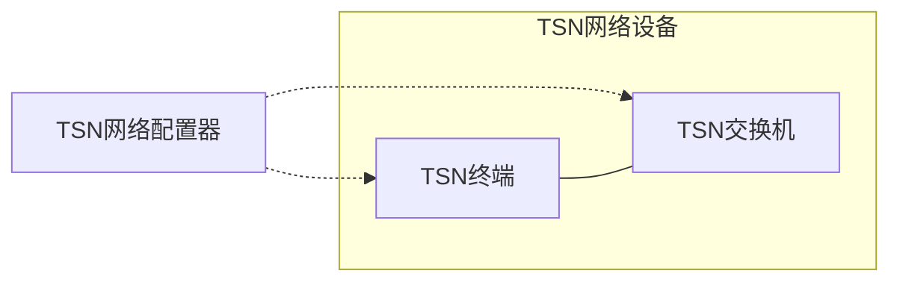
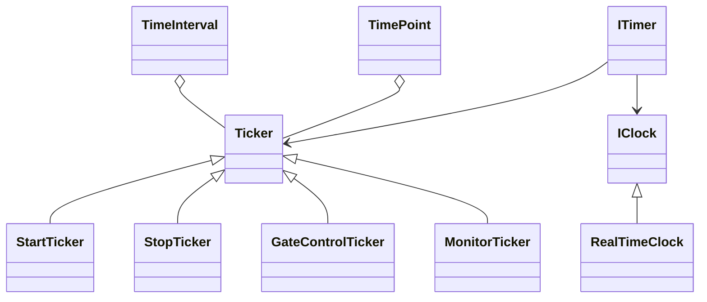
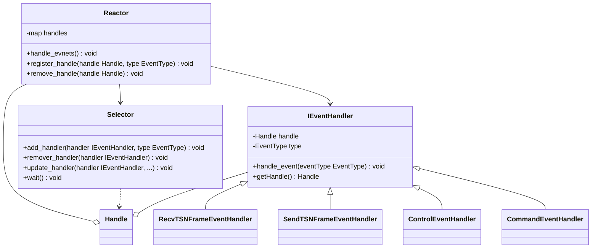
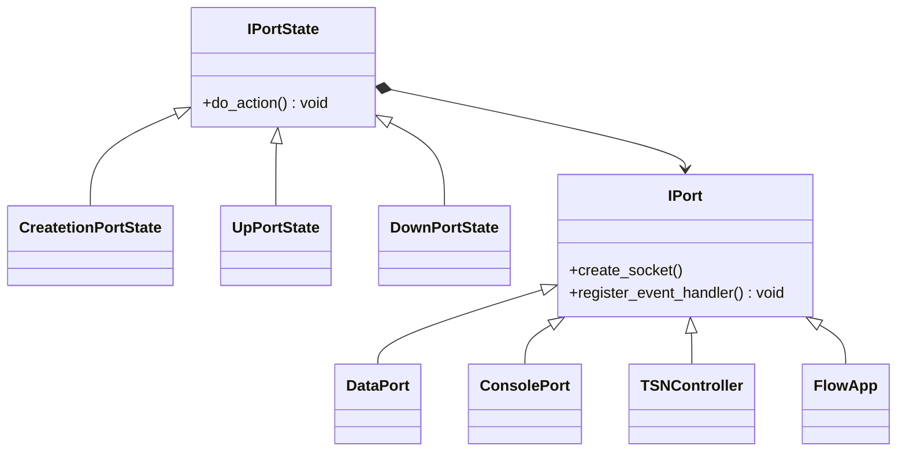

## 总体架构

整个测试床由三部分组成：TSN网络配置器、TSN终端和TSN交换机

- TSN网络配置器：负责控制、配置和监控TSN网络设备
- TSN终端：负责构建、发送和接收链路层PDU
- TSN交换机：负责接收、转发和发送链路层PDU

### 工作模式

- host：以TSN终端模式工作
- switch：以TSN交换机模式工作
- configurator：以TSN网络配置器模式工作

### 上下文

- InitTSNContext
- RunTSNContext
- StopTSNContext

### 配置文件
- config.ini
- routes.xml
- gcl.xml
- flows.xml

## 定时器

TSN网络设备的调度行为是由时间触发的，时间触发可以通过定时器实现。

TSN网络对时间精度有着极高的要求（通常是微妙级别），考虑到硬件条件的限制（缺乏专用的高精度时钟芯片支持）以及内核态和用户态之间的切换开销（我们的程序运行在用户态，使用系统调用时需要在内核态和用户态之间进行切换），测试床的时间精度的设定在毫秒级别。

测试床的定时器具体实现：

- TimeInterval（时间段）：一段连续的时间，用来表示时间的长度。时间段的实现参考了Linux 常用时间结构体（struct timespec），其中第一个属性是秒，第二个属性是纳秒，重载了加减运算符，能够实现时间点与时间点、时间点与时间段之间的加减运算
- TimePoint（时间点）：特殊的时间段，长度从纪元时间(从UTC时间1970年1月1日0时0分0秒)开始的算起，重载了加减运算符，能够实现时间点与时间点、时间点与时间段之间的加减运算
- IClock（时钟）：时钟接口，用于获取当前真实的系统时间，返回TimePoint类型的值
  - RealtTimeClock：反应真实时间的时钟
- Ticker（时钟滴答）：Ticker是定时器的基本操作单位，使用时需要继承Ticker来实现特定的Ticker（例如StartTicker），重载函数运算符，将其变成仿函数对象。
  - StartTicker：将上下文切换到`Run`状态，注册`GateControlTicker`和`MonitorTicker`
  - StopTicker：将上下文切换到`Stop`状态，释放系统资源，冲刷缓冲区
  - GateControlTicker：根据`TimeAwareShaper`的指示周期性刷新`TransmissionGate`的状态
  - MonitorTicker：周期性写监控数据到磁盘

## IO事件框架

IO事件框架使用Reactor设计模式实现。

Reactor设计模式是一种事件驱动的处理模式，用于同时处理多个并发的IO事件。它把系统触发的IO事件进行多路分解，派发给相关的请求处理例程，由相关的处理例程进行进一步的处理。

Reactor设计模式主要成分：

- Handle（操作句柄）：可操作事件的标识符，通常由操作系统提供，如网络套接字、文件描述符等
- Reactor（IO事件处理器）：IO事件处理的调度核心，定义了一些接口，用于控制IO事件调度，以及注册、删除和更新事件处理程序
- Selector（IO事件分离器）：用于阻塞等待一个或多个IO事件的发生。调用者会被阻塞，直到操作句柄集合上有事件发生
- IEventHandler（事件处理程序接口）：由一个或多个模板函数组成的接口，这些模板函数描述了和应用程序相关的对某个事件的操作
- *EventHandler（具体的事件处理程序）：事件处理程序接口的实例，与一个操作句柄关联，使用操作句柄来识别事件、识别应用程序提供的服务

测试床的IO事件框架具体实现：

- Handle是Linux系统的网络套接字，且设置为非阻塞（Non-blocking）模式
- 具体的事件处理程序分为读/写事件类型分为两类
  - RecvTSNFrameEventHandler：读事件类型，负责解析输入的链路层PDU
  - SendTSNFrameEventHandler：写事件类型，负责构造并发送链路层PDU
  - ControlEventHandler：读事件类型，负责解析输入的控制命令，例如启动命令
  - CommandEventHandler：读/写事件类型，读模式下负责处理来自标准输入或者FIFO管道的控制命令，写模式下负责发送控制命令
- Selector封装了epoll，只支持水平触发（Level-triggered）模式，在该模式下一旦内核缓冲区处于就绪状态就会立即触发IO事件，具有极高的响应速度
- Reactor利用关联容器保存操作句柄与具体的事件处理器程序的关联关系，提供事件注册和事件移除等方法，利用Selector分发事件到具体事件处理程序

## Port

每个物理网卡对应一个IPort类型对象。

每个IPort类型对象的生命周期包括：`Create`、`Up`和`Down`，使用状态模式和模版方法模式实现。

IPort是一个接口类型，所有IPort类型实例均实现自Iport接口，并重写（override）纯虚函数，例如DataPort，其中几个模版方法必须按具体功能需求具体实现：

- createSocket：构造对象。对象的初始化过程都应该放在这个方法里，在这过程中可能会暴露`this`指针，不能放在构造函数中进行，因此采用二段式构造
- registerEventHandler：注册IO事件处理程序，例如RecvTSNFrameEventHandler。
- setTimer：注册事件事件处理程序，例如GateControlTicker。

已有IPort类型实例包括：

- DataPort：TSN交换机的数据端口，负责接受和发送链路层PDU
- ConsolePort：TSN网络设备的配置端口，负责接收来自TSN网络配置器的控制信息
- TSNController：TSN网络配置器的控制端口，负责向TSN网络设备发送控制指令
- FlowApp：TSN终端的数据端口，负责构建、接收和发送链路层PDU

