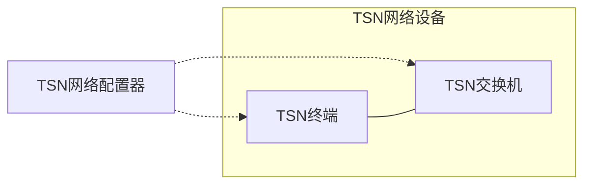
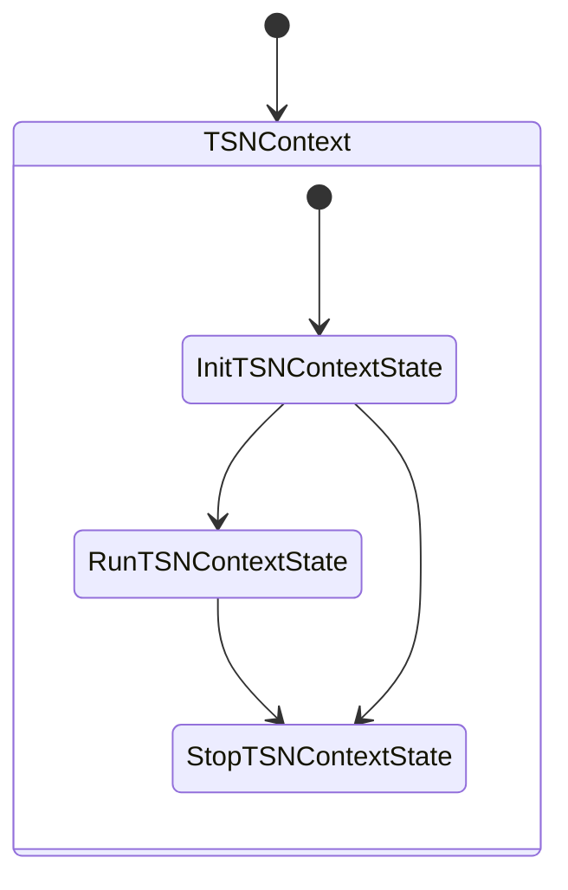
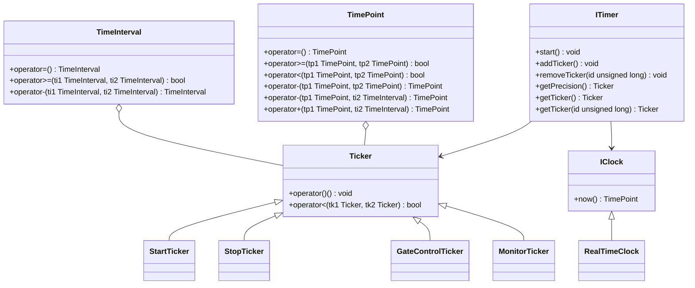
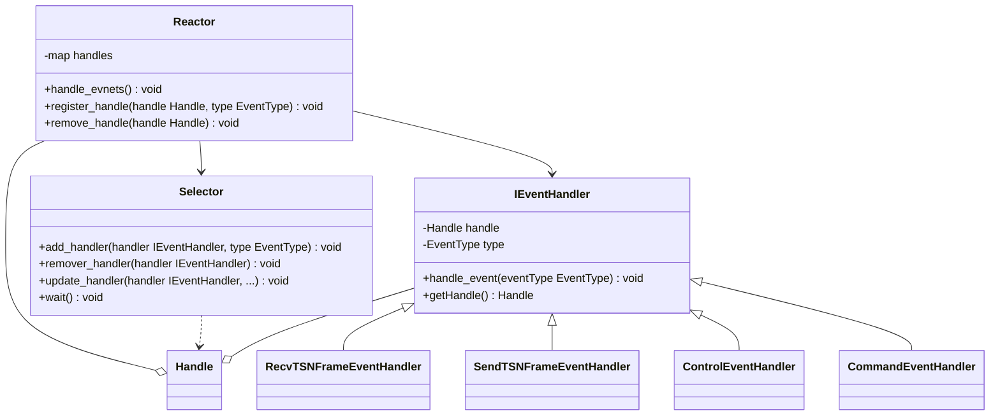
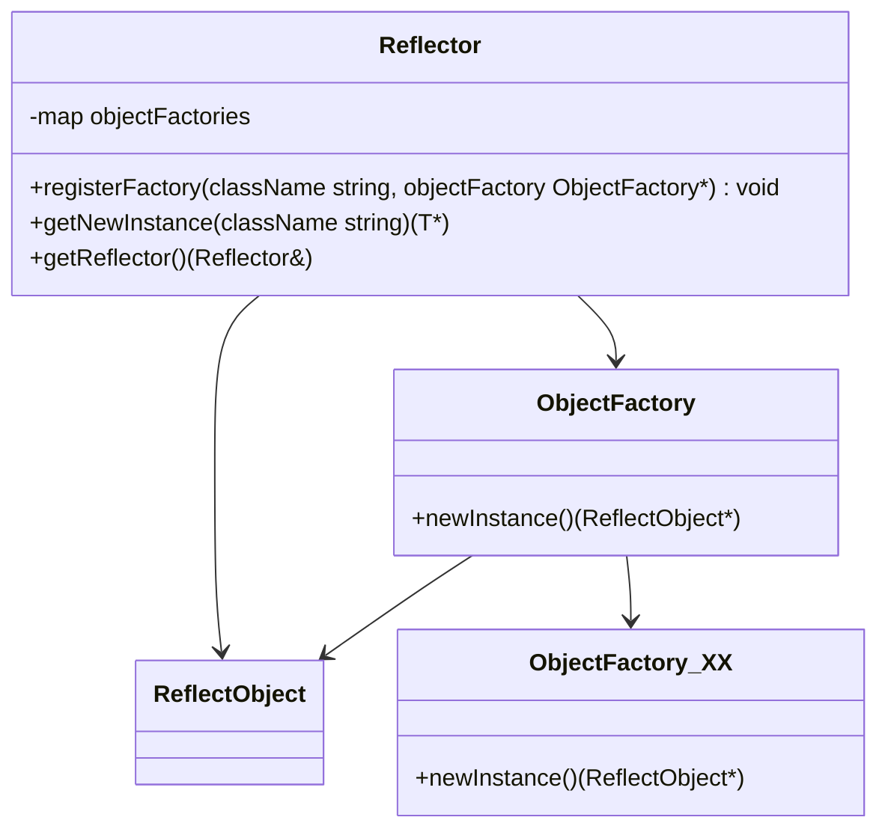
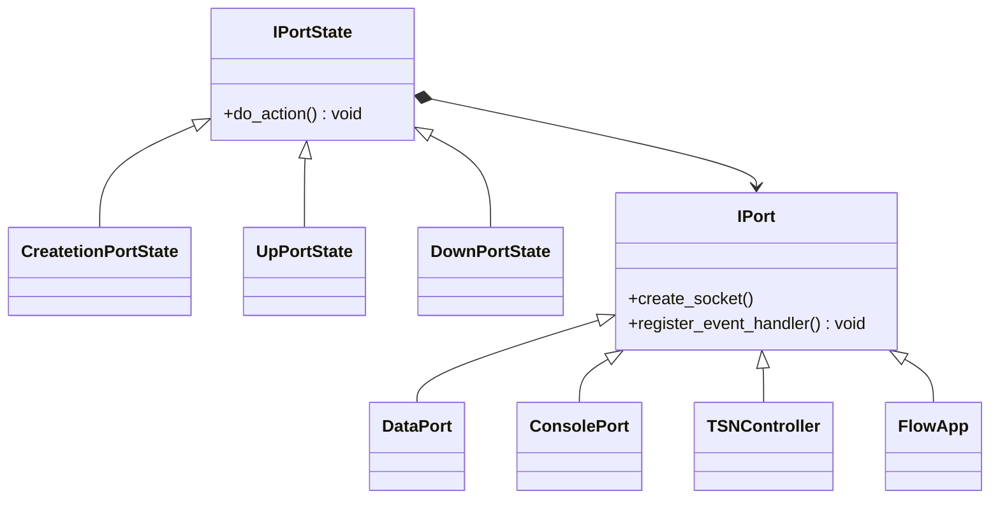
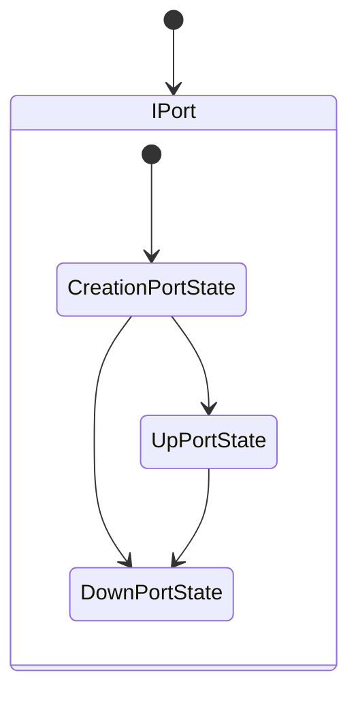

## 总体架构

整个测试床由三部分组成：TSN网络配置器、TSN终端和TSN交换机

- TSN网络配置器：负责控制、配置和监控TSN网络设备
- TSN终端：负责构建、发送和接收链路层PDU
- TSN交换机：负责接收、转发和发送链路层PDU



### 工作模式

测试床支持三种工作方式，通过`config.ini`文件的`workMode`配置项修改：

- `host`：以TSN终端模式工作
- `switch`：以TSN交换机模式工作
- `configurator`：以TSN网络配置器模式工作

### 上下文



测试床维持着一个上下文`TSNContext`，它的生命周期经历三个状态，使用状态模式和单例模式实现：

- InitTSNContextState：初始化状态，在此期间完成测试床的初始化工作，例如读取配置文件
- RunTSNContextState：运行状态，在此期间测试床正常工作
- StopTSNContextState：停止状态，在此期间测试床停止工作，执行收尾工作

除此之外，测试床还维持这一个时间上下文`TimeContext`，用于记录时间状态，同样使用单例模式实现。

### 配置文件

测试床依赖的配置文件有：

- config.ini：测试床配置文件
- routes.xml：路由配置文件
- gcl.xml：调度配置文件
- flows.xml：流配置文件

运行测试床可执行文件时必须通过参数`-f`指定一个`config.ini`文件。

## 运行时环境

### 时间库



TSN网络设备的调度行为是由时间触发的，时间触发可以通过定时器实现。

TSN网络对时间精度有着极高的要求（通常是微妙级别），考虑到硬件条件的限制（缺乏专用的高精度时钟芯片支持）以及内核态和用户态之间的切换开销（我们的程序运行在用户态，使用系统调用时需要在内核态和用户态之间进行切换），测试床的时间精度的设定在毫秒级别。

测试床的时间库具体实现：

- TimeInterval（时间段）：一段连续的时间，用来表示时间的长度。时间段的实现参考了Linux 常用时间结构体（struct timespec），其中第一个属性是秒，第二个属性是纳秒，重载了加减运算符，能够实现时间点与时间点、时间点与时间段之间的加减运算
- TimePoint（时间点）：特殊的时间段，长度从纪元时间(从UTC时间1970年1月1日0时0分0秒)开始的算起，重载了加减运算符，能够实现时间点与时间点、时间点与时间段之间的加减运算
- IClock（时钟）：时钟接口，用于获取当前真实的系统时间，返回TimePoint类型的值
  - RealtTimeClock：反应真实时间的时钟
- Ticker（时钟滴答）：Ticker是定时器的基本操作单位，使用时需要继承Ticker来实现特定的Ticker（例如StartTicker），重载函数运算符，将其变成仿函数对象。
  - StartTicker：将上下文切换到`Run`状态，注册`GateControlTicker`和`MonitorTicker`
  - StopTicker：将上下文切换到`Stop`状态，释放系统资源，冲刷缓冲区
  - GateControlTicker：根据`TimeAwareShaper`的指示周期性刷新`TransmissionGate`的状态
  - MonitorTicker：周期性写监控数据到磁盘
- ITimer（定时器）:定时器接口，通过操作Ticker来实现时间触发事件。
  - PQTimer：优先级队列时钟，它维护着一个Ticker容器，该容器利用最小堆实现，根据Ticker的启动时间升序排序，执行`start()`后循环弹出Ticker，使用POSIX时间库提供的标准接口向系统注册一个时间事件，绑定`on_alar()`回调函数，直到容器为空。当时间事件到期时，系统回调`on_alar()`函数，将到期的Ticker实例指针作为参数传递给`on_alar()`函数，再由`on_alar()`以仿函数的形式调用该Ticker实例，执行具体的动作

使用实例：

```
/* 创建Ticker */
Time::TimePoint start(0, 0); // 启动时间
Time::TimeInterval expire(1, 0); // 超时时间
Ticker* ticker = new MonitorTicker(start, expire);
/* 通过时间上下文获取定时器 */
ITimer* timer = TimeContext::getInstance().getTimer();
/* 添加Ticker到定时器 */
timer->addTicker(ticker);
/* 启动定时器 */
TimeContext::getInstance().getTimer()->start();
```

### IO事件库



IO事件框架使用Reactor设计模式实现。

Reactor设计模式是一种事件驱动的处理模式，用于同时处理多个并发的IO事件。它把系统触发的IO事件进行多路分解，派发给相关的请求处理例程，由相关的处理例程进行进一步的处理。

Reactor设计模式主要成分：

- Handle（操作句柄）：可操作事件的标识符，通常由操作系统提供，如网络套接字、文件描述符等
- Reactor（IO事件处理器）：IO事件处理的调度核心，定义了一些接口，用于控制IO事件调度，以及注册、删除和更新事件处理程序
- Selector（IO事件分离器）：用于阻塞等待一个或多个IO事件的发生。调用者会被阻塞，直到操作句柄集合上有事件发生
- IEventHandler（事件处理程序接口）：由一个或多个模板函数组成的接口，这些模板函数描述了和应用程序相关的对某个事件的操作
- *EventHandler（具体的事件处理程序）：事件处理程序接口的实例，与一个操作句柄关联，使用操作句柄来识别事件、识别应用程序提供的服务

测试床的IO事件框架具体实现：

- Handle是Linux系统的网络套接字，且设置为非阻塞（Non-blocking）模式
- 具体的事件处理程序分为读/写事件类型分为两类
  - RecvTSNFrameEventHandler：读事件类型，负责解析输入的链路层PDU
  - SendTSNFrameEventHandler：写事件类型，负责构造并发送链路层PDU
  - ControlEventHandler：读事件类型，负责解析输入的控制命令，例如启动命令
  - CommandEventHandler：读/写事件类型，读模式下负责处理来自标准输入或者FIFO管道的控制命令，写模式下负责发送控制命令
- Selector封装了epoll，只支持水平触发（Level-triggered）模式，在该模式下一旦内核缓冲区处于就绪状态就会立即触发IO事件，具有极高的响应速度
- Reactor利用关联容器保存操作句柄与具体的事件处理器程序的关联关系，提供事件注册和事件移除等方法，利用Selector分发事件到具体事件处理程序

### 反射库

#### 静态反射

静态反射是在程序编译期间通过宏定义展开实现的，因此也叫编译期反射，它的优点是不会在运行期间产生开销，缺点是对于那些需要具有有参构造函数的类来说使用很不方便，需要另外实现一个`init`函数来完成初始化操作。



需要反射的类必须实现`ReflectObject`接口，因此这种反射方式属于侵入式反射：

```
class Person : public ::ReflectObject {
   public:
    Person() {
        INFO("Person Constructor");
    }
    virtual ~Person() = default;
    virtual void show() {
        INFO("Person");
    }
};

class Bob : public Person {
   public:
    Bob() {
        INFO("Bob Constructor");
    }
    virtual void show() override {
        INFO("Bob");
    }
};
```

实现了`ReflectObject`接口的类可以作为父类，但是其子类就不允许再被继承了，否则会有bug。

需要在源文件中显式地调用宏函数`REFLECT`来注册需要反射的类，该函数会在编译期原地展开成为一个`ObjectFactory`实例，例如`ObjectFactory_Bob`：

```
REFLECT(Bob);    // register "Bob"
```

注册好后就可以在需要时候使用下面代码来进行反射：

```
Person* bob = ::Reflector::getNewInstance<Person>("Bob");
bob->show();
```

#### 动态反射

动态反射是在程序运行期间通过宏定义展开实现的，因此也叫运行期反射。

动态反射的实现则比较复杂，需要借助标准库中的`std::function`、模版和ABI来实现。

```mermaid
classDiagram
    class REFLECT_OBJECT {

    }

    class REFLECT_OBJECTFactory {
        -map<string, function<REFLECT_OBJECT*(Targs&&...)> m_mapCreateFunction
        -REFLECT_OBJECTFactory<Targs...>* s_pREFLECT_OBJECTFactory
        +Instance() (REFLECT_OBJECTFactory*)
        +Regist(string typeName, pFunc function<REFLECT_OBJECT*(Targs&&... args)>) bool
        +UnRegist(string typeName) bool
        +Create(const string& strTypeName, Targs&&... args) (REFLECT_OBJECT*)
    }

    class DynamicCreator {
        -Register s_oRegister
        +CreateObject(Targs&&... args) (T*)
    }

    class Register {

    }

    class REFLECTOR {
        +CreateByTypeName(const std::string& strTypeName, Targs&&... args) (REFLECT_OBJECT*)
    }

    REFLECTOR --> REFLECT_OBJECTFactory
    REFLECT_OBJECTFactory --> REFLECT_OBJECT
    DynamicCreator --> Register
    Register ..> REFLECT_OBJECTFactory
```

`DynamicCreator::s_oRegister`是静态成员，它的类型是`DynamicCreator<T, Targs...>::Register`，在程序一开始就完成初始化，其构造函数内部调用`REFLECT_OBJECTFactory<Targs...>::Regist`方法来注册一个反射类型。

`REFLECT_OBJECTFactory<Targs...>::Regist`方法接收两个参数

- 一个是`std::string`类型的字符串，表示类型名称
- 一个是`std::function<REFLECT_OBJECT*(Targs&&... args)>`类型的函数，实际传入的是`DynamicCreator::CreateObject`函数，该函数支持传入可变长参数，用来调用反射类型的构造函数。

`REFLECT_OBJECTFactory<Targs...>`类型是一个单例，`REFLECTOR`通过调用其`Create`方法来构造出一个`REFLECT_OBJECT`类型的对象。

需要反射的类需要实现`REFLECT_OBJECT`接口并继承`DynamicCreato<T>`，因此这种方式也属于入侵式反射：

```
class IAnimal {
public:
    virtual ~IAnimal() = default;
    virtual void Say() = 0;
};

class Dog : public IAnimal, public REFLECT_OBJECT, public DynamicCreator<Dog> {
public:
    Dog(std::string name) { 
        std::cout << "My name is " << name << std::endl;
    }
    virtual ~Dog() override = default;

    virtual void Say() override {
        INFO("wang\n");
    }
};

```

使用时非常简单，只需要使用下面代码：

```
REFLECT_OBJECT* dog = REFLECTOR::CreateByTypeName(std::string("Dog"), std::string("Xiaobai"));
dog->Say();
```

## 核心组件

### Port



每个物理网卡对应一个IPort类型对象。



每个IPort类型对象的生命周期经历三个状态：`Creation`、`Up`和`Down`，使用状态模式和模版方法模式实现。

- `CreationPortState`
- `UpPortState`
- `DownPortState`

IPort是一个接口类型，所有IPort类型实例均实现自Iport接口，并重写（override）纯虚函数，例如DataPort，其中几个模版方法必须按具体功能需求具体实现：

- `createSocket`：构造对象。对象的初始化过程都应该放在这个方法里，在这过程中可能会暴露`this`指针，不能放在构造函数中进行，因此采用二段式构造
- `registerEventHandler`：注册IO事件处理程序，例如RecvTSNFrameEventHandler。
- `setTimer`：注册事件事件处理程序，例如GateControlTicker。

已有IPort类型实例包括：

- DataPort：TSN交换机的数据端口，负责接受和发送链路层PDU
- ConsolePort：TSN网络设备的配置端口，负责接收来自TSN网络配置器的控制信息
- TSNController：TSN网络配置器的控制端口，负责向TSN网络设备发送控制指令
- FlowApp：TSN终端的数据端口，负责构建、接收和发送链路层PDU

